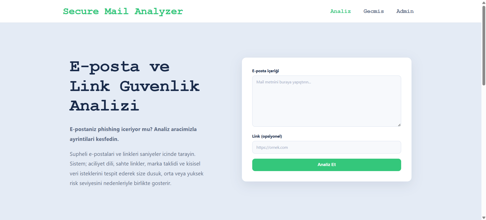
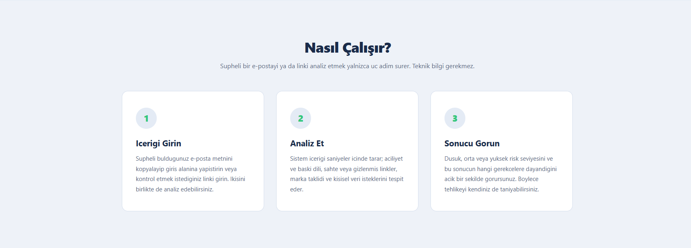
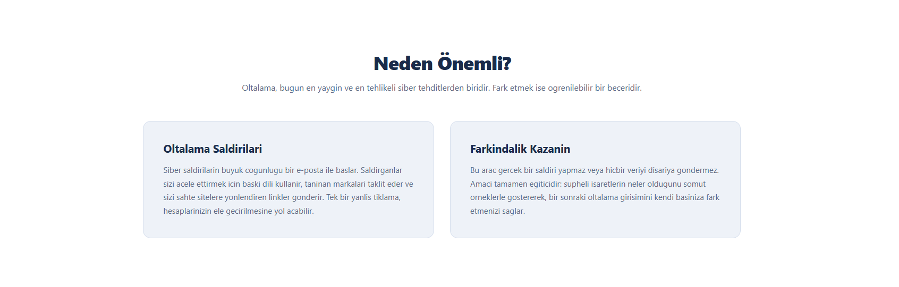
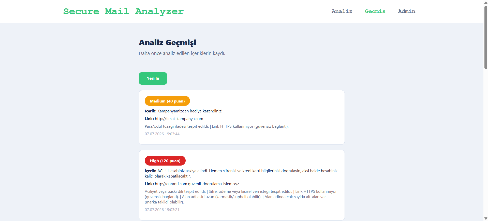
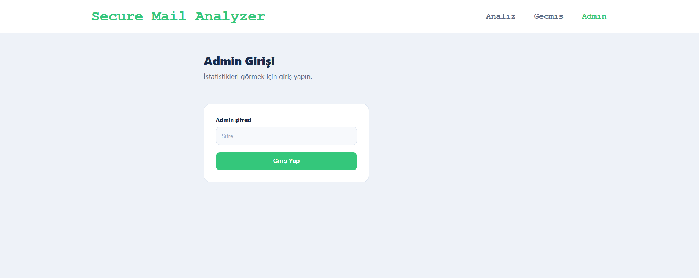
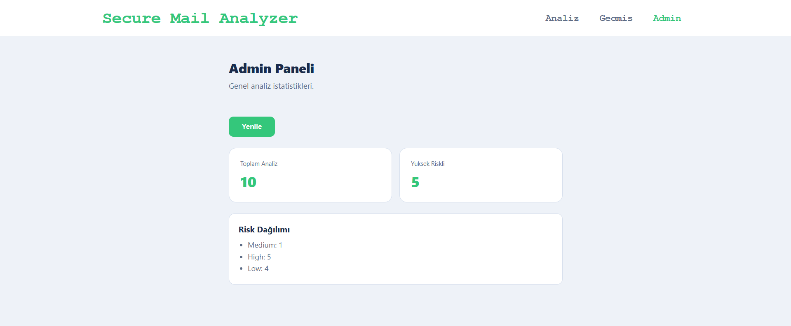

# Secure Mail Analyzer

Oltalama (phishing) ve sosyal mühendislik farkındalığı için geliştirilen, e-posta içeriği ve link güvenlik analiz platformu. Kullanıcı bir e-posta metni veya link girer; sistem içeriği analiz ederek düşük, orta veya yüksek risk seviyesini **gerekçeleriyle birlikte** gösterir. Amaç gerçek bir saldırı yapmak değil, kullanıcıların şüpheli içerikleri fark etmesini sağlayan eğitim odaklı bir araç sunmaktır.

## İçindekiler

- [Özellikler](#özellikler)
- [Kullanılan Teknolojiler](#kullanılan-teknolojiler)
- [Ekran Görüntüleri](#ekran-görüntüleri)
- [Proje Yapısı](#proje-yapısı)
- [Kurulum ve Çalıştırma](#kurulum-ve-çalıştırma)
  - [Docker Compose ile](#docker-compose-ile-önerilen)
  - [Kubernetes ile](#kubernetes-ile)
- [Analiz Mantığı](#analiz-mantığı)
- [Ortam Değişkenleri](#ortam-değişkenleri)

## Özellikler

- E-posta içeriği ve/veya link girişi
- Metin analizi: aciliyet/baskı dili, şifre ve kişisel veri isteği, marka taklidi, şüpheli ek dosya, para/ödül tuzağı tespiti
- Link analizi: HTTPS kontrolü, IP adresi kullanımı, aşırı uzun veya karmaşık alan adı, fazla rakam/tire, link kısaltıcı, çok sayıda alt-alan (marka taklidi) tespiti
- Puan tabanlı risk değerlendirmesi (düşük / orta / yüksek) ve her sonucun **nedeninin** açıklanması
- Analiz geçmişinin görüntülenmesi
- Şifre korumalı admin paneli: toplam analiz sayısı, risk seviyelerine göre dağılım
- Docker ve Docker Compose ile tek komutla çalıştırma
- Kubernetes deployment dosyaları

## Kullanılan Teknolojiler

| Katman | Teknoloji |
|--------|-----------|
| Backend | .NET 9 Web API (C#) |
| Frontend | React (Vite) |
| Veritabanı | PostgreSQL |
| ORM | Entity Framework Core |
| Container | Docker, Docker Compose |
| Orkestrasyon | Kubernetes (Docker Desktop / Minikube) |
| Web sunucusu (frontend) | Nginx |

## Ekran Görüntüleri

**Ana sayfa ve analiz ekranı**





**Analiz geçmişi**



**Admin girişi ve paneli**




## Proje Yapısı

```
secure-mail-analyzer/
├── backend/
│   └── SecureMailAnalyzer.Api/   # .NET Web API (analiz, geçmiş, admin, veritabanı)
├── frontend/                     # React (Vite) arayüzü
├── database/                     # Veritabanı ile ilgili notlar
├── k8s/                          # Kubernetes deployment ve service dosyaları
├── docs/                         # Ekran görüntüleri
├── docker-compose.yml            # Üç servisi tek komutla ayağa kaldırır
├── .env.example                  # Örnek ortam değişkenleri
└── README.md
```

## Kurulum ve Çalıştırma

Projeyi çalıştırmanın iki yolu vardır: **Docker Compose** (en basit) ve **Kubernetes**.

### Ön gereksinimler

- [Docker Desktop](https://www.docker.com/products/docker-desktop/) (Docker ve Docker Compose içerir)
- Kubernetes için: Docker Desktop içindeki Kubernetes özelliği veya Minikube

### Ortam değişkenlerini hazırlama

Gizli bilgiler (şifreler, token) koda gömülü değildir; bir `.env` dosyasından okunur. Önce örnek dosyayı kopyalayıp kendi değerlerinizi girin:

```bash
cp .env.example .env
```

Ardından `.env` dosyasını açıp değerleri doldurun (aşağıdaki [Ortam Değişkenleri](#ortam-değişkenleri) bölümüne bakın).

### Docker Compose ile (önerilen)

Ana klasörde tek bir komut yeterlidir:

```bash
docker compose up --build
```

Bu komut backend, frontend ve PostgreSQL veritabanını birlikte ayağa kaldırır. Hazır olduğunda tarayıcıdan açın:

```
http://localhost:5173
```

Durdurmak için:

```bash
docker compose down
```

### Kubernetes ile

Önce Docker imajlarının oluşturulmuş olması gerekir (Docker Compose adımı bu imajları oluşturur):

```bash
docker compose build
```

Ardından Kubernetes dosyalarını uygulayın:

```bash
kubectl apply -f k8s/
```

Pod'ların çalıştığını kontrol edin (hepsi `Running` olmalı):

```bash
kubectl get pods
```

Uygulamaya tarayıcıdan erişin:

```
http://localhost:30073
```

> **Not:** Kubernetes kurulumunda frontend, backend'e `30059` NodePort'u üzerinden bağlanır ve backend'in CORS ayarı `http://localhost:30073` adresine izin verir. Bu değerler `k8s/` dosyalarında ve backend yapılandırmasında tanımlıdır.

## Analiz Mantığı

Sistem, girilen içeriği bir dizi kural üzerinden puanlar. Her tetiklenen kural hem toplam puana katkıda bulunur hem de kullanıcıya "neden riskli" açıklaması olarak gösterilir. Toplam puan eşiklerle karşılaştırılarak risk seviyesine dönüştürülür:

- **Düşük (Low):** 0–29 puan
- **Orta (Medium):** 30–59 puan
- **Yüksek (High):** 60 ve üzeri

Metin analizinde aciliyet dili, kişisel/ödeme bilgisi isteği, marka taklidi, şüpheli ek dosya ve para/ödül tuzağı gibi işaretler aranır. Link analizinde ise HTTPS kullanımı, IP adresi, alan adı uzunluğu ve karmaşıklığı, link kısaltıcı kullanımı ve alt-alan derinliği gibi teknik göstergeler kontrol edilir.

## Ortam Değişkenleri

`.env` dosyasında tanımlanması gereken değişkenler:

| Değişken | Açıklama |
|----------|----------|
| `POSTGRES_USER` | PostgreSQL kullanıcı adı |
| `POSTGRES_PASSWORD` | PostgreSQL şifresi |
| `POSTGRES_DB` | Veritabanı adı |
| `ADMIN_PASSWORD` | Admin paneline giriş şifresi |
| `ADMIN_TOKEN` | Admin isteklerinin doğrulandığı gizli anahtar |

> Gerçek `.env` dosyası `.gitignore` ile hariç tutulmuştur ve depoya gönderilmez. Depoda yalnızca örnek şablon olan `.env.example` bulunur.

---

Bu proje eğitim ve farkındalık amacıyla geliştirilmiştir. Gerçek kullanıcı e-postaları kullanılmamalı; testler için örnek/yapay içerikler oluşturulmalıdır.
